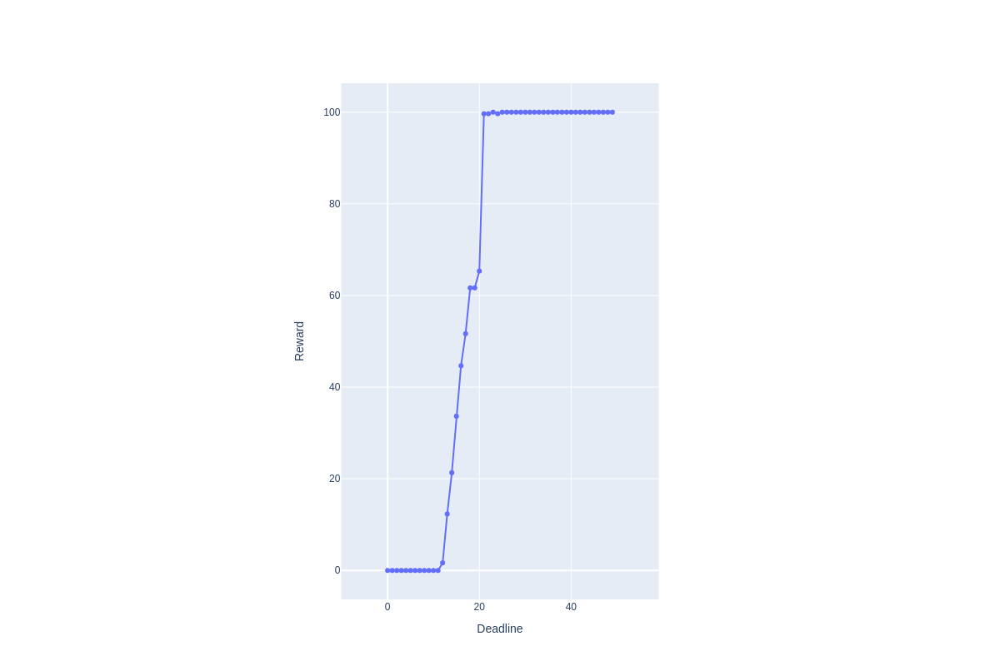

# Metareasoning
# Setup 
1. git clone https://github.com/jasmeetkaur9/metareasoning.git
2. pip install -r requirements.txt
3. install [https://github.com/caelan/pybullet-planning](Pybullet-Planning)

# Run experiments 
python scripts/exp_performance.py

# Plots
1. 
2. 
