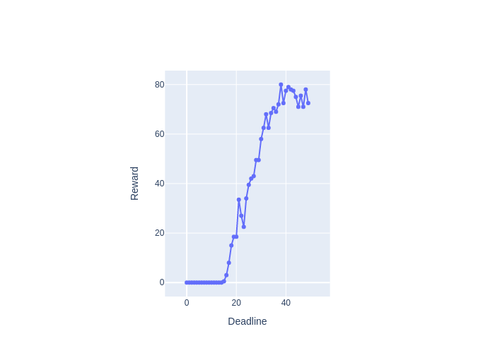
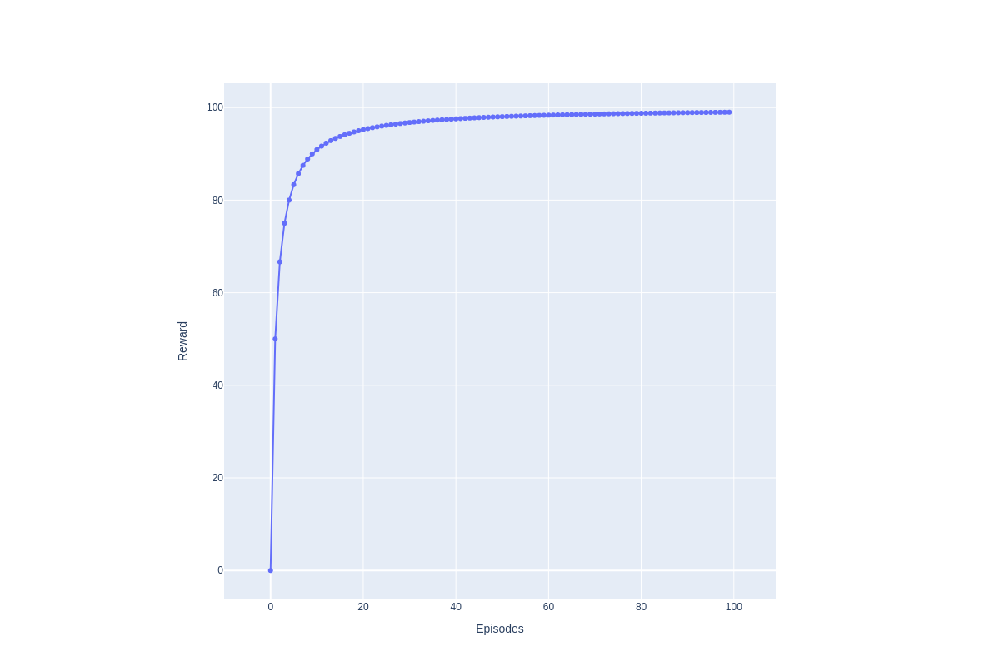
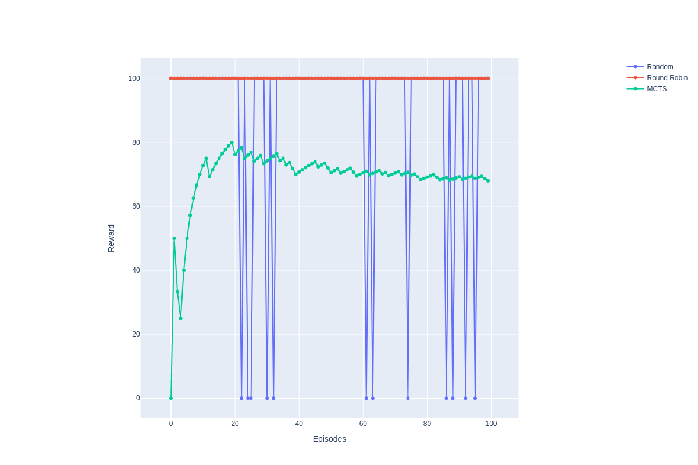

# Metareasoning
# Setup 
```
1. git clone https://github.com/jasmeetkaur9/metareasoning.git
2. pip install -r requirements.txt
3. install [https://github.com/caelan/pybullet-planning](Pybullet-Planning)
4. update model files provided in data
```

# Run experiments 
```
  python scripts/exp_performance.py
  python scripts/exp_ppo.py
```
# Plots
<table>
  <tr>
    <td align="center">
          MCTS Agent </td>
    <td align="center">
          PPO Agent</td>
  </tr>
  <tr>
    <td align="center">
    Deadline 30, 3 symbolic plans</td>
    <td align="center">
    Deadline 30, 2 symbolic plans</td>
  </tr>
</table>


